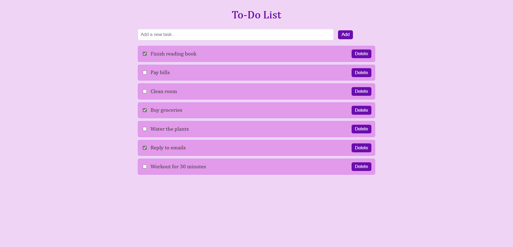

# To-Do List Web App

A To-Do List web application built using **HTML, CSS, JavaScript**, and a **minimal ASP.NET Core API**.  
Tasks are stored locally in a `tasks.json` file — no database required. 

## Interface

<div align="center" style="margin: 2rem 0; border: 1px solid #e1e4e8; border-radius: 8px; padding: 1rem; background: white; box-shadow: 0 1px 3px rgba(0,0,0,0.1); max-width: 800px; margin-left: auto; margin-right: auto;">
  
  <p style="text-align: center; margin-top: 0.5rem; color: #586069; font-size: 0.9rem;"> To-Do List Web Application Interface</p>
</div>

## Features

- View, add, update, and delete tasks
- Minimal API with file-based storage
- Basic HTML/CSS/JS front-end
- Fast and lightweight

## API Endpoints

- `GET /api/tasks` – Get all tasks
- `POST /api/tasks` – Add a new task
- `PUT /api/tasks/{id}` – Update task
- `DELETE /api/tasks/{id}` – Delete task

## Example `tasks.json`

```json
[
  { "id": 1, "title": "Buy groceries", "isCompleted": false },
  { "id": 2, "title": "Complete homework", "isCompleted": true },
  { "id": 3, "title": "Finish reading book", "isCompleted": false },
  { "id": 4, "title": "Water the plants", "isCompleted": true }
]
```
Getting Started
Clone the repository:
```bash
git clone https://github.com/jurcaade/To-Do-List-App.git
cd To-Do-List-App
```
Run the app:
```bash
dotnet run
```

Open your browser and go to:
```bash
http://localhost:5000
```

## Tech Stack

- C# with ASP.NET Core (.NET 8)
- HTML5 + CSS3 + JavaScript
- JSON (for data storage)
